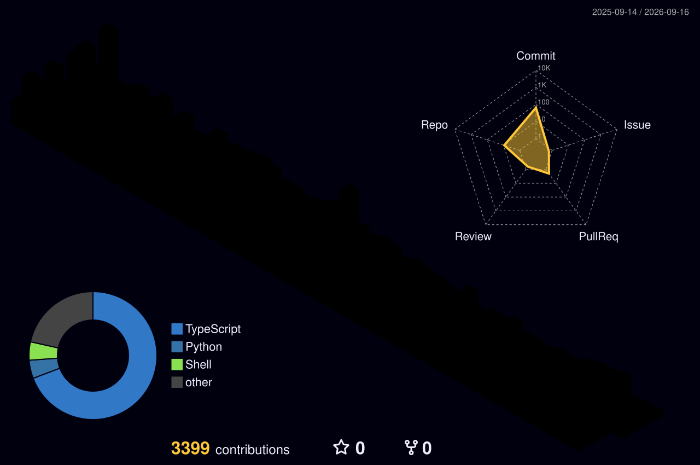

<!-- Dynamic Typing Header -->

  

 

  
<strong>B.Tech CSE @ KIIT University, Bhubaneswar (5th Semester)</strong>

  
Building high-performance systems, immersive low-poly 3D environments, and sleek web interfaces.

  
  
  

 

---

### 🚀 What I'm Building
- 💻 **Systems & Backend:** Crafting secure, locked-down environments using **Node.js** (like Safe Exam Browser integrations) and exploring networking with **Tailscale & RustDesk**.
- 🎮 **Indie Game Dev:** Developing logic with **GDScript** in **Godot 4** and modeling low-poly assets in **Blender 5**.
- 🌐 **Web & UI/UX:** Designing freelance landing pages with **Framer** and **Figma**.

 

### 🌌 Tech Arsenal

   
  <strong>Core Languages</strong> 
  
  
  
  
    
  <strong>Game Dev & Design</strong> 
  
  
  
  
    
  <strong>OS & Workflow</strong> 
  
  
  

 

---

### 📊 GitHub Analytics

  
  

 

### 🧊 Contribution Topography

  

